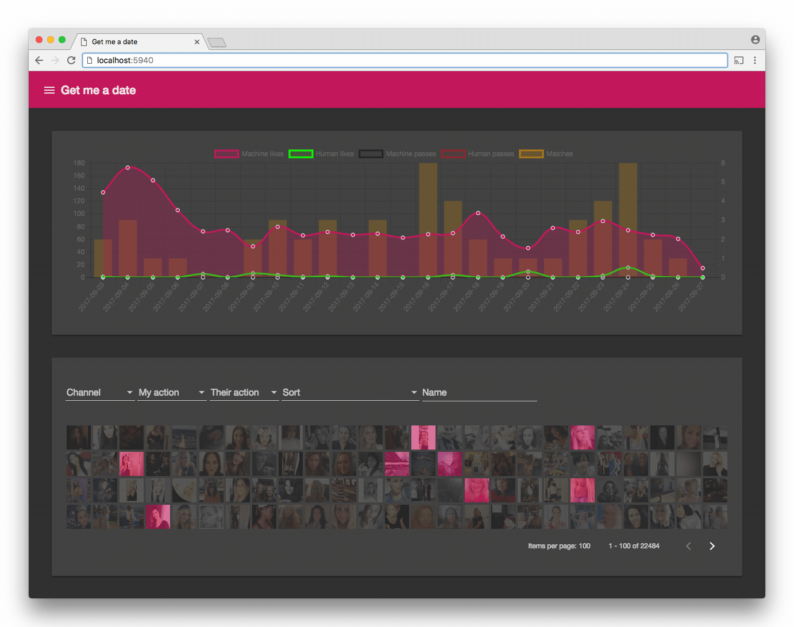

# :heart_eyes: Help me get a :cupid: date tonight :first_quarter_moon_with_face:

[](http://standardjs.com/)
[](https://travis-ci.org/hfreire/get-me-a-date)
[](https://coveralls.io/github/hfreire/get-me-a-date?branch=master)
[](https://greenkeeper.io/)
[](https://github.com/hfreire/get-me-a-date/releases)
[](LICENSE)
[](https://hub.docker.com/r/hfreire/get-me-a-date/)
[](https://hub.docker.com/r/hfreire/get-me-a-date/)

Uses [AWS Rekognition](https://aws.amazon.com/rekognition) deep learning-based image recognition to help you automate your date discovery.

<p align="center"></p>

### Features
* Supports [Tinder](https://github.com/hfreire/tinder-wrapper) dating app :white_check_mark:
* Supports [Happn](https://github.com/hfreire/happn-wrapper) dating app :white_check_mark:
* Uses your existing matches :revolving_hearts: for machine-learning :robot: when to :+1: or :-1: new recommendations :white_check_mark:
* Periodically :clock10: gets dating app :girl::woman: recommendations and automatically :robot: :+1: or :-1: :white_check_mark:
* Launch :rocket: inside a Docker container :whale: so you don't need to manage the dependencies :raised_hands: :white_check_mark:

### How to use

#### Use it in your terminal
Run the Docker image in a container exposing the port `5940`
```
docker run -d -p "5940:3000" hfreire/get-me-a-date
```
#### Available environment variables
Variable | Description | Required | Default value
:---:|:---:|:---:|:---:
FIND_DATES_PERIOD | The time period (in seconds) between finding dates. | false | `600`
PORT | The port to be used by the HTTP server. | false | `3000`
API_KEYS | The secret keys that should be used when securing endpoints. | false | `undefined`
SO_TIMEOUT | TCP socket connection timeout. | false | `120000`
LOG_LEVEL | The log level verbosity. | false | `info`
ENVIRONMENT | The environment the app is running on. | false | `undefined`
ROLLBAR_API_KEY | The server API key used to talk with Rollbar. | false | `undefined`

### How to build
Clone the GitHub repo
```
git clone https://github.com/hfreire/get-me-a-date.git
```

Change current directory
```
cd get-me-a-date
```

Install dependencies
```
npm install
```

Run the NPM script that will build the Docker image
```
npm run build
```
